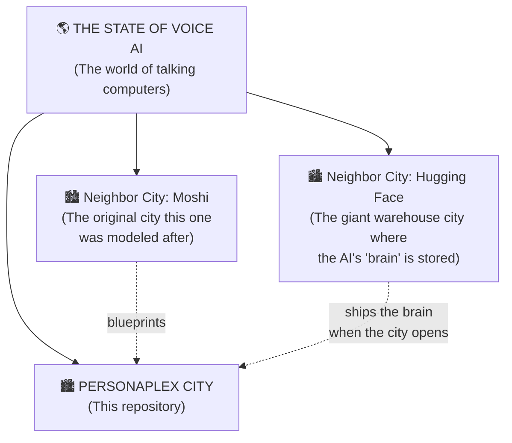
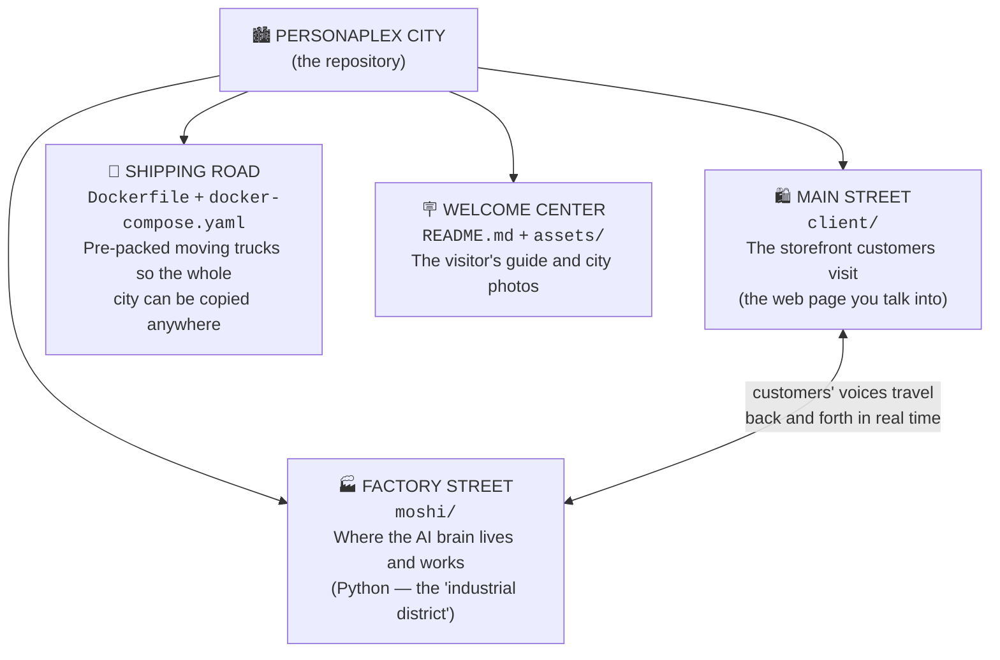
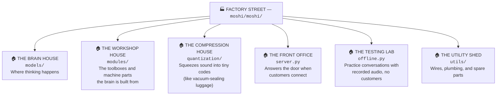
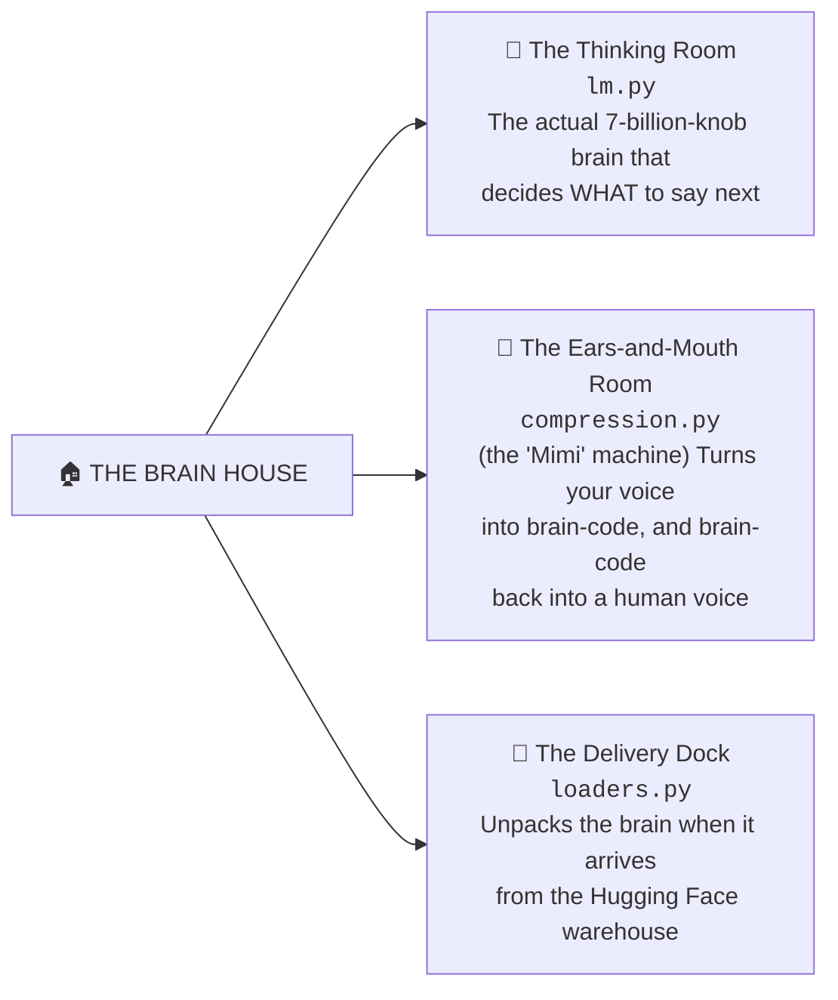
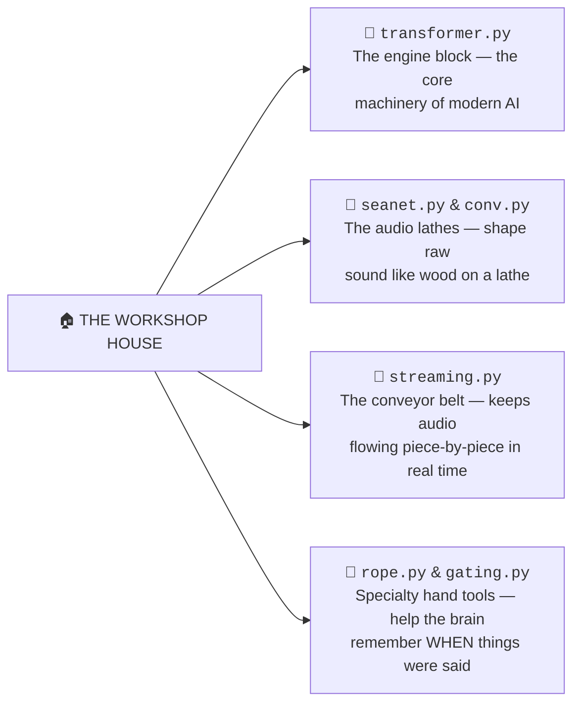
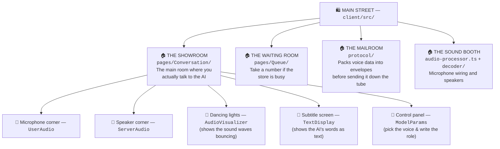
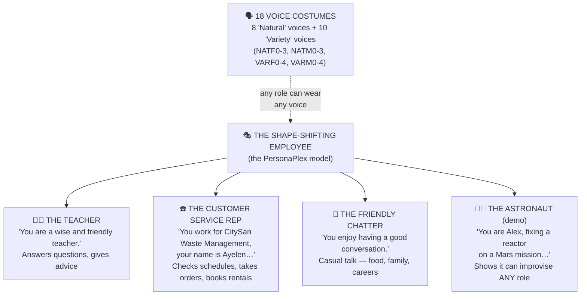
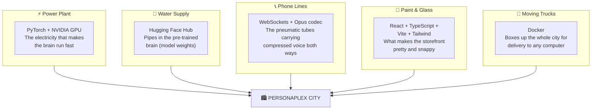
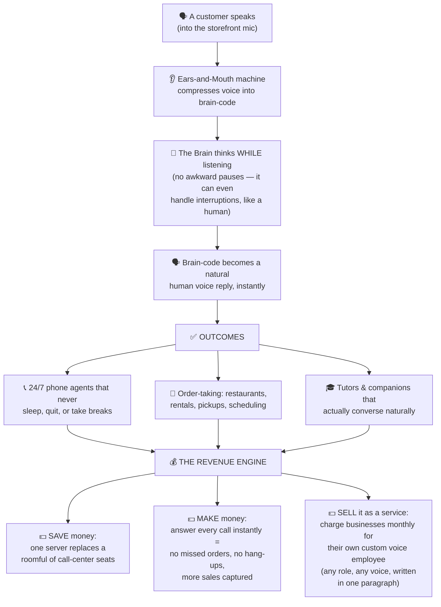
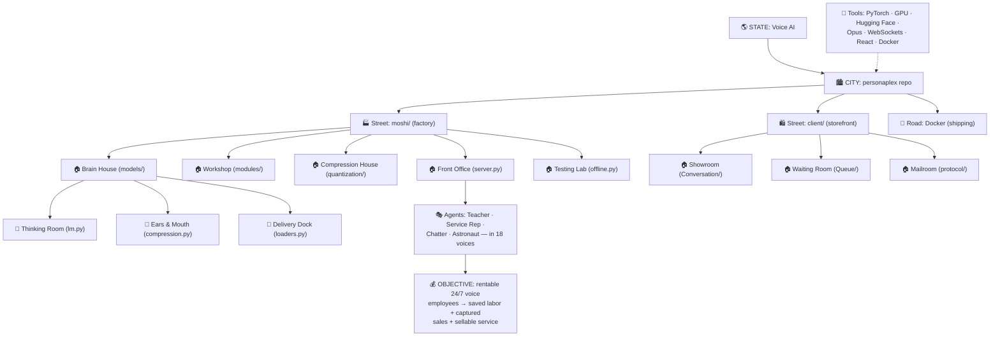

# 🗺️ The PersonaPlex City Map

**A non-technical tour of this entire repository — explained like a city, with streets, houses, rooms, workers, and the money it was built to make.**

> 💡 **How to read this:** Every diagram below is drawn with "Mermaid," which GitHub turns into real pictures automatically. Just scroll — the maps render right on this page.

---

## 🏛️ The Big Idea (Before We Enter the City)

Imagine you could hire an employee who:

- **Never sleeps** ☕
- **Answers the phone instantly**, in a friendly human voice 📞
- Can be told *"Today you work for a pizza shop"* or *"Today you're a drone rental clerk"* — and instantly plays that role perfectly 🎭
- Can **talk and listen at the same time**, just like a real person (no awkward walkie-talkie pauses)

That employee is **PersonaPlex**. This repository is the **city where that employee lives, trains, and works**.

---

## 🌎 Level 1: The State → The City

**The analogy:** Voice AI is the *state* — a huge territory full of cities trying to make computers talk. **PersonaPlex City** (this repo) is one city in that state. It was built using blueprints from an older city called **Moshi**, and every morning it imports its "brain" (the trained model weights) from a giant warehouse city called **Hugging Face** — like a city that imports its power generator instead of building one from scratch.

---

## 🏙️ Level 2: The City and Its Streets

The city has **two main streets** plus a few service roads.

**The analogy:**
- **Factory Street (`moshi/`)** is the industrial side of town. No customers come here — this is where the heavy machinery (the AI model) actually *thinks*.
- **Main Street (`client/`)** is the pretty storefront — the web page with a microphone button where real people talk to the AI.
- **Shipping Road (Docker files)** is like a fleet of moving trucks: the entire city, furniture and all, can be boxed up and rebuilt on any computer in minutes.
- The two streets are connected by a **pneumatic tube** (a WebSocket) that whooshes voice audio back and forth about 12 times per second.

---

## 🏭 Level 3: Factory Street — The Houses

### 🚪 Inside the Brain House (`models/`) — The Rooms

**The analogy:** Think of the Brain House like a **call-center employee's head**:
- The **Ears-and-Mouth Room** (`compression.py`, a machine called *Mimi*) is the ears and voice box. It converts messy sound waves into neat little numbered tokens — like turning a song into sheet music — and back again.
- The **Thinking Room** (`lm.py`) reads that sheet music and composes the reply *while still listening* — that's the "full duplex" magic. Most voice AIs are walkie-talkies; this one is a real phone call.
- The **Delivery Dock** (`loaders.py`) is the receiving bay where the pre-trained brain (gigabytes of learned knowledge) gets unboxed and installed each time the server starts.

### 🚪 Inside the Workshop House (`modules/`) — The Rooms

---

## 🛍️ Level 4: Main Street — The Storefront

**The analogy:** Main Street is like an **Apple Store for talking to AI**. You walk into the Showroom, the Control Panel lets you choose which employee you want (a friendly female voice? a calm male voice? — 18 voices total, named things like `NATF2` and `NATM1`), you hand them a job description, and you just… start talking. The dancing lights show your voice and the AI's voice as moving waves, and subtitles scroll by so you can read along.

---

## 🤖 Level 5: The Agents — Who Works in This City?

Here's the fun part. The city employs **one shape-shifting actor** who can play any role you write on a sticky note (the "text prompt"):

**The analogy:** It's like one brilliant improv actor with a **closet of 18 voice costumes**. You slide a script under the door — *"You work at Jerusalem Shakshuka, a restaurant. Classic shakshuka is $9.50…"* — and seconds later that actor IS the restaurant employee, in whichever voice you picked, taking orders without missing a beat.

---

## 🧰 Level 6: The Tools — The City's Utilities

| Tool | Plain-English job |
|---|---|
| **PyTorch** | The math engine — the power plant that runs the brain's billions of calculations |
| **NVIDIA GPU** | The turbocharger — without it, the AI would think too slowly to hold a live call |
| **Hugging Face** | The warehouse that ships the already-trained brain (you don't train it yourself) |
| **Opus codec** | A sound shrink-ray — squeezes voice tiny so it travels the internet fast |
| **WebSockets** | An always-open phone line between storefront and factory (no redialing) |
| **React / Vite / Tailwind** | The interior decorators of the storefront web page |
| **Docker** | "City-in-a-box" — clone the whole operation onto any machine with one command |

---

## 💰 Level 7: The Objective — How Does This City Make Money?

This is **why the city was built**. The complete pipeline, from your voice to value:

**The analogy:** Every small business loses money two ways on the phone: paying someone to answer it, and *not* answering it (a missed call at a pizza shop is a lost $30 order). PersonaPlex City exists to fix both at once. Because the "employee" learns a new job from **a single paragraph of instructions** — no retraining, no onboarding — one copy of this city can serve a waste-management company at 9 AM, a shakshuka restaurant at noon, and a drone rental shop at 5 PM. **That's the business: rentable, instantly-retrainable voice employees.**

> ⚖️ **Honest fine print:** The code in this repo is free to use (MIT license), but the brain itself (the model weights from NVIDIA) ships under the *NVIDIA Open Model License* — so check that license before charging customers. This repo is the engine; the business plan is what you bolt onto it.

---

## 🧭 The Whole City on One Page

---

*Map drawn from the actual contents of this repository: the `moshi/` Python package (server, offline runner, models, modules, quantization, utils), the `client/` React app (Conversation, Queue, protocol, audio workers), the Docker packaging, and the README's voices, roles, and prompting guide.*
